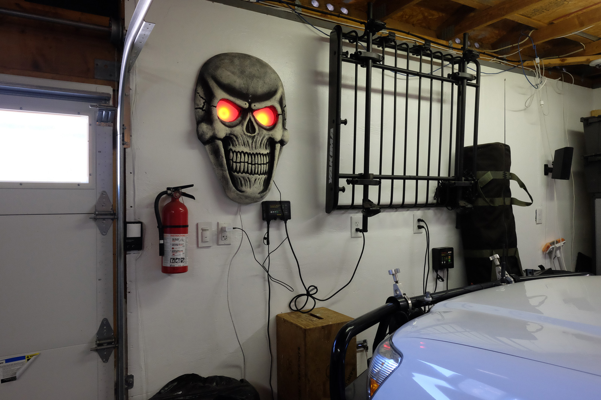
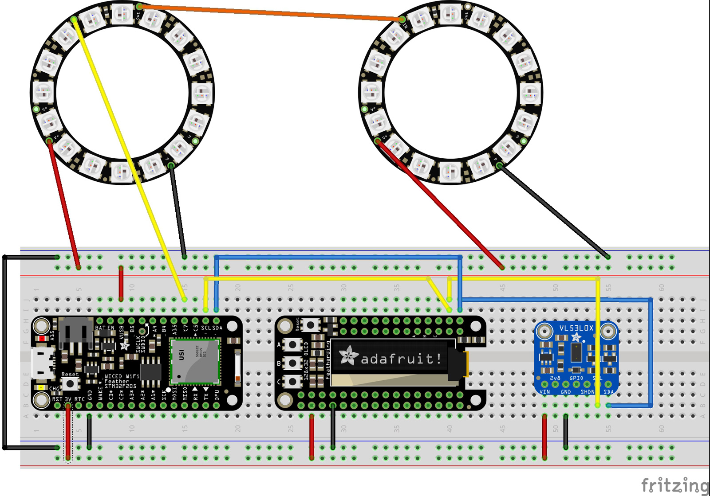

# Parking Assist

This project uses a VL53L0x Lidar time-of-flight sensor, a microcrontroller, and some 16 led neopixel rings stuffed
into a skull to help with parking your vehicle in your garage.  The LEDs animate from green, yellow, to red to 
give you a visual indication on when to stop.

## Getting Started

You will need to prototype the circuit first.  While you can get some of these parts through cheaper sources such as ebay,
I like to buy mine from Adafruit to support all of the work they've done.  I really like the Arduino compatible
Adafruit Feather line.  I used a WICED Feather for this project because I have some future enhancements I want to make,
but that is *overkill* for this project.  If you are new to Arduino/microcontrollers, then I suggest starting
with the Adafruit Feather 32u4 Basic Proto instead.

The VL53L0x sensor interfaces via an i2c bus, so connect the SDA/SCL to the corresponding SDA/SCL pins on your 
microcontroller, and then connect the VIN/GND pins to power.  The neopixels get connected to V+/GND and a
General Purpose I/O (GPIO) pin on your microcontroller.   

I needed positioning flexibility, so I separated the sensor from the microcontroller, and I am running the i2c bus over
a small length of CAT-5 Ethernet cable.  You can fit it all on one breadboard to start experimenting first.

PARTS:

    VL53L0x Laser time-of-flight sensor 50mm-1200mm range
    https://www.adafruit.com/product/3317
    
    Adafruit WICED WiFi Feather - STM32F205 with Cypress WICED WiFi
    NOTE - you can use a cheaper micro without the wifi
    https://www.adafruit.com/product/3056

    Adafruit Feather 32u4 Basic Proto - this is a good substitute
    if you don't want the cost/complexity of the WICED feather
    https://www.adafruit.com/product/2771

    FeatherWing OLED - 128x32 OLED Add-on 
    NOTE - not essential and the code can be built without OLED support
    https://www.adafruit.com/product/2900

    2 Pcs RJ45 8-pin Connector (8P8C) and Breakout Board Kit 
    NOTE - I separated the sensor and micro into two different pcb's
    so I could have mounting flexibility. I use a small CAT5 Ethernet
    cable as an i2c bus between the pcb's
    https://www.amazon.com/gp/product/B0156JXSF8/

    2 Adafruit Perma-Proto Mint Tin Size Breadboard PCB
    https://www.adafruit.com/product/723

### Breadboard/Prototype Circuit

### Prerequisites

You will need the Arduino - make sure to install the proper board
support using the Arduino IDE Board Manager option
https://www.arduino.cc/en/Main/Software

Install the following libraries into your Arduino/Libraries folder

Neopixel support
https://github.com/adafruit/Adafruit_NeoPixel

Adafruit Core Graphics Library
https://github.com/adafruit/Adafruit-GFX-Library

Adafruit OLED library
https://github.com/adafruit/Adafruit_SSD1306

VL53L0X sensor library 
https://github.com/pololu/vl53l0x-arduino

## Building/Installing

1.  Open the led-light-laser-rangefinder.ino file in the Arduino IDE.
1.  Select the proper board you are using by selecting Tools->Boards->Board Manager from within the IDE
1.  In the #defines section, modify the appropriate #defines for the neopixel data pin, the activity led, and if you are using the OLED display.
1.  Verify the software builds successfully
1.  Upload to the device

## Authors

* **Sean Foley** - *Initial work*

## License

You are free to use this code anyway you see fit.

## Acknowledgments

Big thanks for the readme.md template
https://gist.github.com/PurpleBooth/109311bb0361f32d87a2